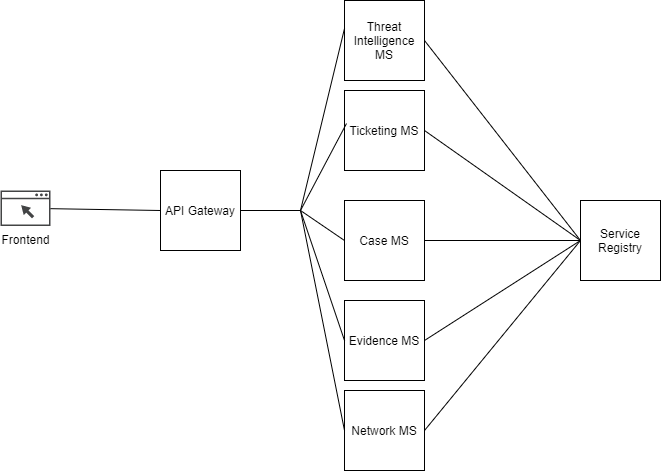

# Overview

An incident response is a very dynamic and stressing scenario. Every minute counts and communication between the team members have to be quick. Therefore this web app will be created.

# Goals
- Ticketing System
- Communication System:
    - Secure Chatting
    - Threat Intelligence
- Save evidence
- Plan tasks
- Network mapping

# Proposed Solution

## Mircroservice Architecture

## Technology Stack
- Service Registry: Spring Eureka Server
- API Gateway: Spring API Gateway
- Frameworks: JUnit, Spring Boot, Angular
- Programming Languages: Javascript, HTML, CSS, Java 11
- Container Technology: Docker & Docker-Compose

# Testability, Monitoring and Alerting
- Unit Testing with JUnit 
- Integration Testing with inbuild utilities of Spring
- Monitoring: optional Hystrix Server
